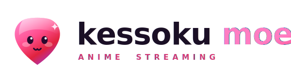
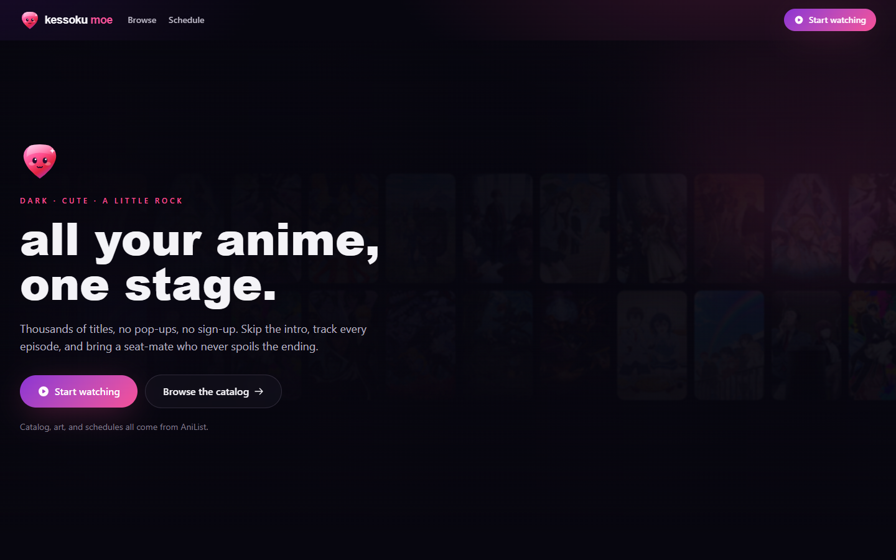
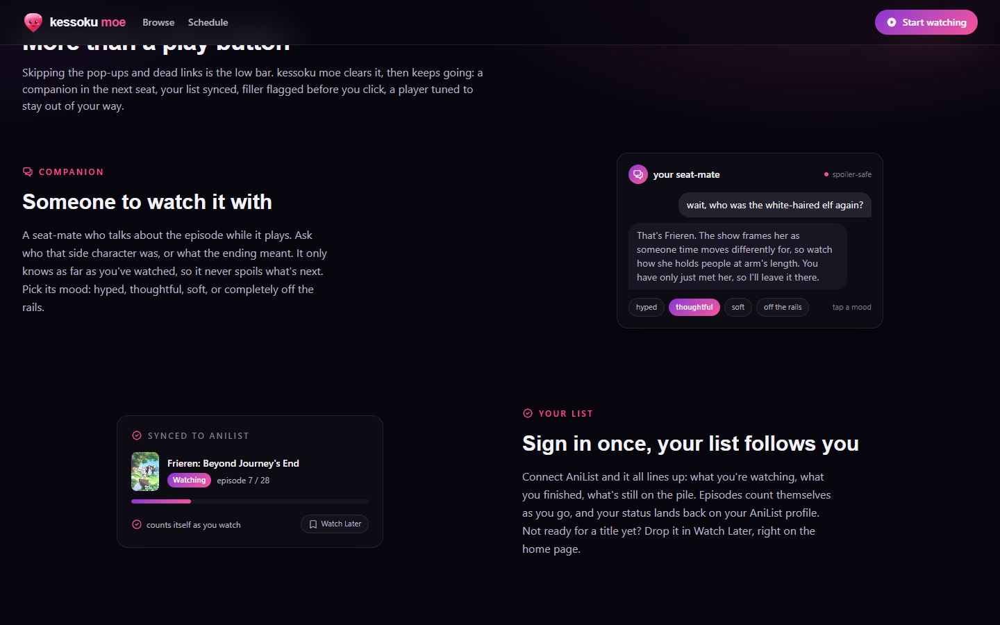
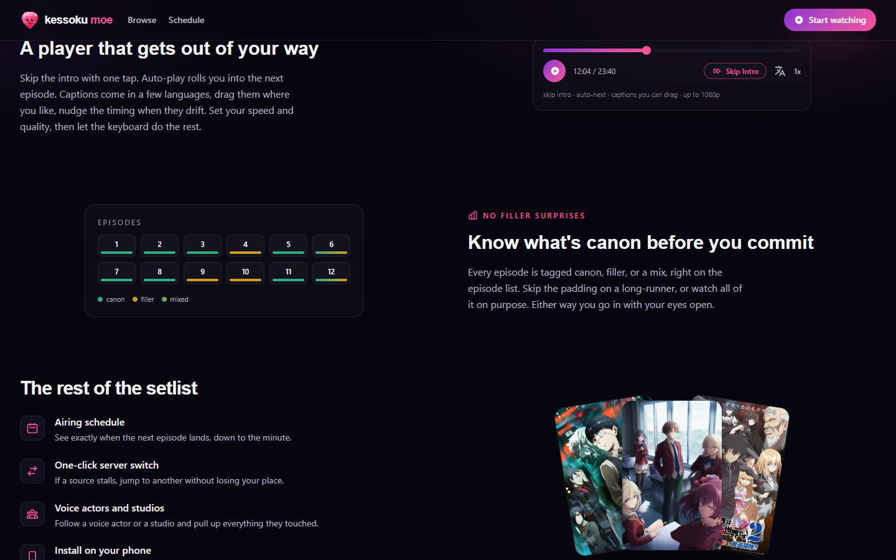

<!-- PROJECT HEADER -->
<div align="center">

  <picture>
    <source media="(prefers-color-scheme: dark)" srcset="frontend/public/kessoku-moe-horizontal.svg">
    
  </picture>

  <h3>all your anime, one stage.</h3>
  <p><em>dark · cute · a little rock</em></p>

  <p>
    
    
    
    
    
  </p>

</div>

<p align="center">
  
</p>

A self-hostable anime streaming app. Search a title, hit play, and skip the parts you came to skip. No pop-up roulette, no five servers before one loads, no account just to watch one episode.

It runs on Next.js and Tailwind, with the catalog, cover art, and airing schedules coming straight from [AniList](https://anilist.co). The app is a fork of [chirag-droid/animeflix](https://github.com/chirag-droid/animeflix), rebuilt around a full redesign and a handful of things the original never had. The name is a nod to Kessoku Band, the band from *Bocchi the Rock!*

## The setlist

- **A seat-mate who never spoils the ending.** An in-player companion that talks about the episode while it plays. Ask who that side character was, or what the ending meant. It only knows as far as you've watched, and you pick its mood: hyped, thoughtful, soft, or completely off the rails.
- **Sign in once, your list follows you.** Connect AniList and it lines up what you're watching, what you finished, and what's still on the pile. Episodes count themselves as you go, your status lands back on your AniList profile, and anything you're not ready for drops into Watch Later.
- **A player that stays out of your way.** One tap skips the intro. Auto-play rolls you into the next episode. Captions come in a few languages, drag them where you want, nudge the timing when they drift. Set your speed and quality, then let the keyboard do the rest.
- **Canon or filler, flagged before you click.** Every episode is tagged canon, filler, or a mix, right on the episode list. Skip the padding on a long-runner, or watch all of it on purpose.
- **An airing schedule with live countdowns.** See exactly when the next episode lands, down to the minute.
- **One-click server switch.** If a source stalls, jump to another without losing your place.
- **Voice actors and studios.** Follow a voice actor or a studio and pull up everything they touched.
- **Install it on your phone.** Add it to the home screen and it runs like an app, no store.

<p align="center">
  
</p>

## Where the video comes from

Titles play through a switchable set of third-party embed sources today, so when one stalls you switch without losing your place. Point the app at a self-hosted source service (the "Option B" pipeline) and the same titles play in the in-house player instead, with direct HLS and the caption controls above. Bringing the whole pipeline in-house is the long game. The plan and its status live in [docs/STREAMING-ROADMAP.md](docs/STREAMING-ROADMAP.md).

<p align="center">
  
</p>

## Run it locally

You need [Node.js](https://nodejs.org) 18+ and [Yarn](https://yarnpkg.com).

```bash
git clone https://github.com/okashiina/kessoku-moe
cd kessoku-moe
yarn install
cp frontend/.env.example frontend/.env.local   # optional, see below
yarn dev
```

That starts the app on http://localhost:3000. For a production build, run `yarn build` then `yarn start`.

Everything in `.env.local` is optional. Leave it blank and the app still runs: the companion panel shows a setup note instead of chatting, and AniList sign-in stays off until you add a client id. The three things worth filling in:

| Feature | Variables | Notes |
| --- | --- | --- |
| AniList sync | `NEXT_PUBLIC_ANILIST_CLIENT_ID`, `ANILIST_CLIENT_SECRET` | Create an AniList API client, set its redirect to `<origin>/auth/callback`. |
| Watch companion | `COMPANION_API_KEY`, `COMPANION_MODEL` | Any OpenAI-compatible endpoint. A [free Gemini key](https://aistudio.google.com/apikey) works out of the box. |
| Self-hosted video | `NEXT_PUBLIC_SOURCE_SERVICE_URL` | Points the player at your source service. Unset means the embed fallback. |

Full annotations are in [frontend/.env.example](frontend/.env.example).

## Project layout

This is a [Turborepo](https://turbo.build) monorepo:

- `frontend/` is the Next.js app: pages, components, the player, the companion.
- `packages/` holds shared code, including the AniList GraphQL client.
- `services/source-service/` is the self-hosted source pipeline (Option B).
- `docs/` keeps the [streaming roadmap](docs/STREAMING-ROADMAP.md), the [design system](docs/DESIGN.md) ("Midnight Aurora"), and a [competitive analysis](docs/COMPETITIVE-ANALYSIS.md).

## Deploy

The repo ships a `Dockerfile`, so anything that builds from a Dockerfile can host it. It currently runs on [Railway](https://railway.app), which rebuilds and redeploys on every push to `main`.

## Credits

- [AniList](https://anilist.co) provides the catalog, cover art, and schedule data through its public GraphQL API.
- Forked from [chirag-droid/animeflix](https://github.com/chirag-droid/animeflix), the original open-source streaming app this grew out of.
- Built with [Next.js](https://nextjs.org), [React](https://react.dev), [Tailwind CSS](https://tailwindcss.com), [Framer Motion](https://www.framer.com/motion/), and [Redux Toolkit](https://redux-toolkit.js.org).

## License

[AGPL-3.0](LICENSE), same as the upstream project. If you run a modified copy as a network service, you have to share your source.
